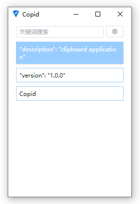
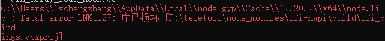
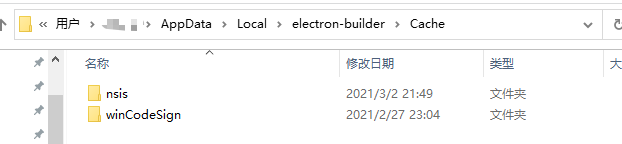
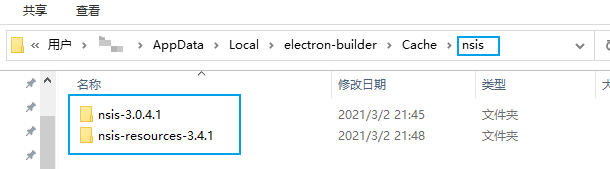
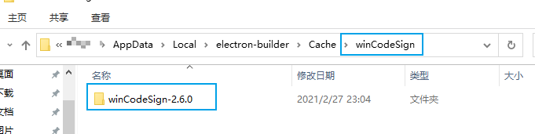

## 介绍

一个极简的剪贴板记录工具，快速呼出面板搜索记录，实现自动粘贴功能。



## 开始使用

`F1` 唤起面板，`Up Down` 选择记录，`Enter` 选中记录并自动激活上一个窗口，手动 `Ctrl+V` 粘贴。

- 支持自动粘贴，在设置中开启
- 支持按队列方式存储、输出记录，`Ctrl+Alt+V` 清空队列，依次复制之后，`Ctrl+Shift+V` 按复制顺序逐条粘贴记录（队列最多存储20条）。

## 本地开发

1、安装环境

on Windows
- Node 18.x
- Visual Studio 2017
- windows-build-tools
- Python3

on Mac
- Node 18.x
- Xcode
- Python3

```shell
# 安装全局库
npm i -g node-gyp ts-node esno webpack webpack-cli rimraf prisma concurrently vite
```

2、安装依赖

```shell
npm i
```

3、构建库

```shell
npm run task build
```

4、运行

```shell
npm run task dev
```

---

## 本地构建

```shell
# 生成可运行程序
npm run task pack

# 生成安装包
npm run task make
```

注意：构建时关闭本地运行的 Copid

注意：构建时，需要先执行“本地调试”中的 1~3 步骤

---

## 排错

一、fatal error LNK1127: 库已损坏



删除该目录 `C:\Users\<owner>\AppData\Local\node-gyp\Cache`

二、本地构建时，需要下载构建资源，由于网络原因导致构建失败

将本项目中的 `doc/deps` 中的压缩包，解压至 `C:\Users\<owner>\AppData\Local\electron-builder\Cache` 目录下：




